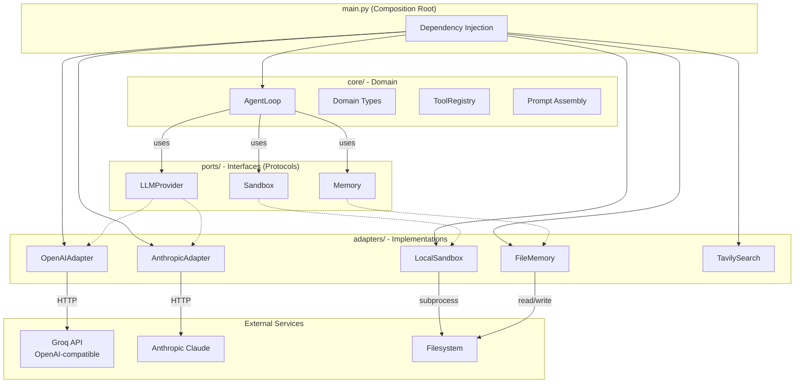
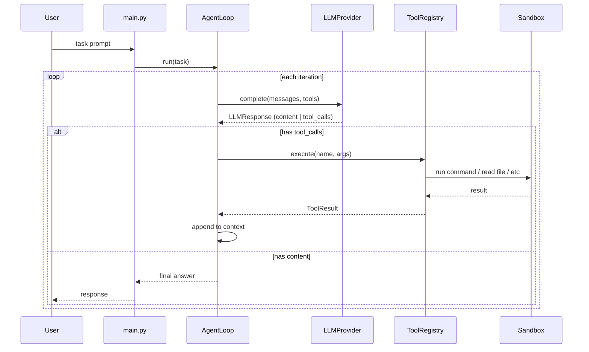
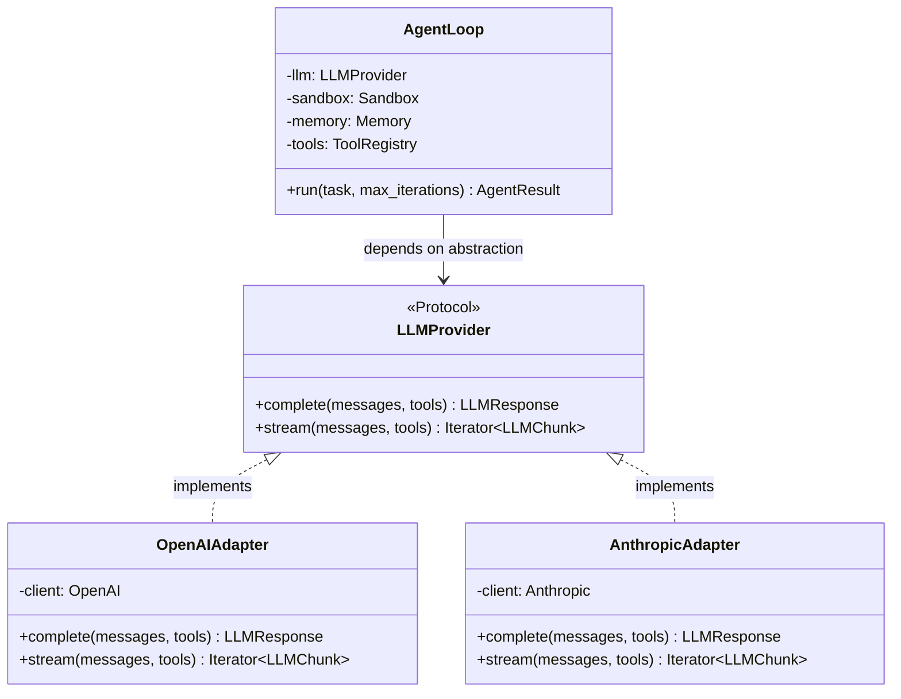
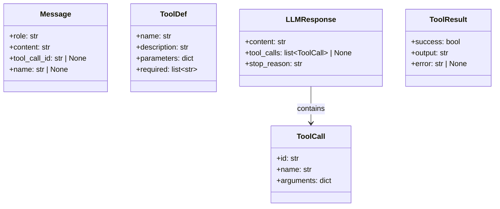

# Sarvagya Architecture

Autonomous AI agent. One loop, one action per iteration, filesystem as memory, provider-agnostic.

## Hexagonal Architecture (Ports & Adapters)



## Data Flow



## Provider Abstraction



## Domain Types



## Design Decisions

| Decision | Choice | Rationale |
|----------|--------|-----------|
| Architecture | Hexagonal (Ports & Adapters) | Zero coupling to LLM providers |
| Language | Python 3.13+ | Latest typing, pattern matching, dataclasses |
| LLM Abstraction | Protocol with adapters | Swap OpenAI/Anthropic/Groq via config |
| Sandbox | Local subprocess + Cloud (future) | Start local, add E2B later |
| Memory | Filesystem (markdown) | Proven pattern, no DB needed |
| Package Manager | uv | Fast, modern Python packaging |
| Linting | ruff | Fast, replaces flake8 + isort |
| Typing | mypy --strict | Bug prevention at compile time |

## File Structure

```
sarvagya/
  __init__.py
  main.py                  # Composition root
  core/
    __init__.py
    types.py               # Shared domain types
    loop.py                # Agent loop (framework-agnostic)
    tools.py               # Tool registry
    context.py             # Prompt assembly
  ports/
    __init__.py
    llm.py                 # LLMProvider protocol
    sandbox.py             # Sandbox protocol
    memory.py              # Memory protocol
    search.py              # WebSearch protocol
  adapters/
    __init__.py
    llm/
      __init__.py
      openai.py            # OpenAI/Groq adapter (OpenAI-compatible)
      anthropic.py         # Anthropic adapter
    sandbox/
      __init__.py
      local.py             # Local subprocess sandbox
    memory/
      __init__.py
      filesystem.py        # Filesystem memory
    search/
      __init__.py
      tavily.py            # Tavily web search
```

## Rules

1. **`core/` imports ZERO external packages.** Only stdlib + local modules.
2. **`ports/` defines only Protocols.** No implementations, no third-party imports.
3. **`adapters/` is the ONLY layer that imports SDKs.** One file per provider.
4. **`main.py` is the ONLY composition root.** Adapters are wired to ports here.
5. **One action per iteration.** Agent calls ONE tool, observes result, repeats.
6. **Filesystem as context.** Session data lives in files, not in-memory.
