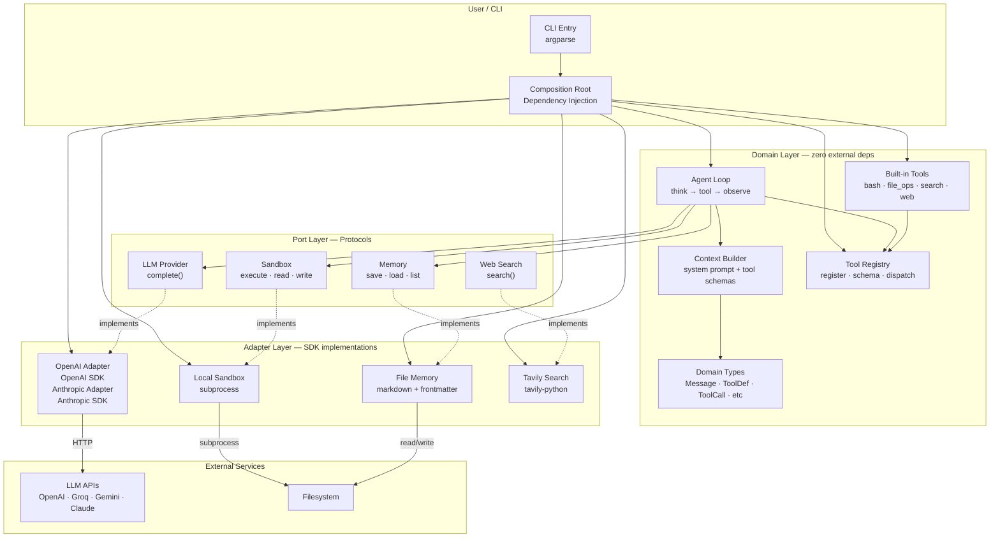
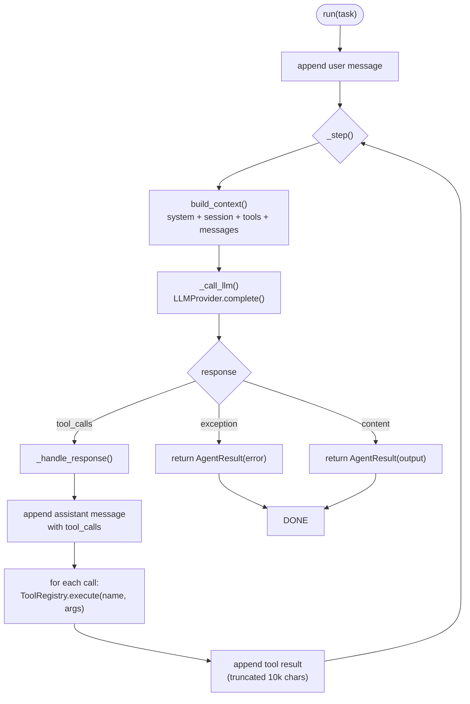
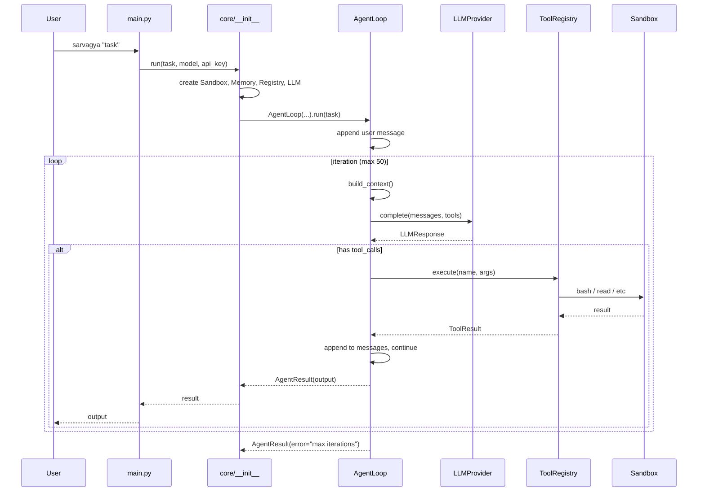
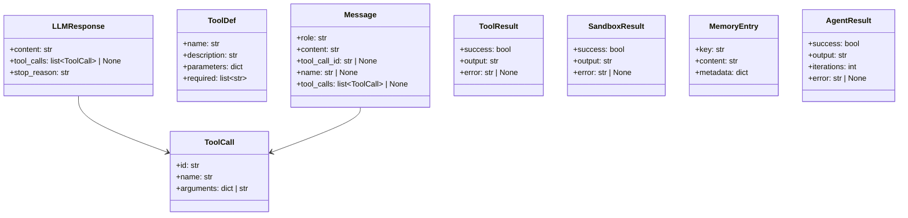

# Sarvagya

Autonomous AI agent with hexagonal architecture. Zero coupling to LLM providers. ~1000 lines.

```bash
pip install -e ".[all]"
set API_KEY=sk-...   set MODEL=gpt-4o
sarvagya "List all Python files in this project"
```

---

## Architecture

Sarvagya uses **hexagonal architecture (Ports & Adapters)**. The domain layer (`core/`) imports **zero external packages**. All SDK coupling lives in `adapters/`. Providers are swapped by changing the model name — no config, no code changes.



## Agent Loop

One action per iteration — think, call one tool, observe, repeat.



## File Structure

```
sarvagya/
├── main.py                    CLI entry + DI container (36 lines)
├── prompts/
│   └── system.md              Agent identity & rules (markdown)
├── core/                      Domain — zero external dependencies
│   ├── __init__.py            Composition root (60 lines)
│   ├── types.py               8 dataclasses (62 lines)
│   ├── loop.py                AgentLoop — think/tool/observe (76 lines)
│   ├── context.py             System prompt + message assembly (49 lines)
│   ├── tool_registry.py       Register, schema, dispatch (45 lines)
│   └── tools/
│       ├── __init__.py        init_tools() (18 lines)
│       ├── bash.py            Shell execution (39 lines)
│       ├── file_ops.py        Read/write/edit (93 lines)
│       ├── search_ops.py      Glob/grep (56 lines)
│       └── web.py             Web fetch (31 lines)
├── ports/                     Protocols — pure Python, no deps
│   ├── llm.py                 LLMProvider (12 lines)
│   ├── sandbox.py             Sandbox (19 lines)
│   ├── memory.py              Memory (19 lines)
│   └── search.py              WebSearch (6 lines)
└── adapters/                  SDK implementations — one file per provider
    ├── llm/
    │   ├── openai.py          OpenAI / Groq / Gemini (63 lines)
    │   └── anthropic.py       Anthropic Claude (79 lines)
    ├── sandbox/
    │   └── local.py           Subprocess sandbox (47 lines)
    ├── memory/
    │   └── filesystem.py      Markdown with YAML frontmatter (64 lines)
    └── search/
        └── tavily.py          Tavily web search (18 lines)
```

## Data Flow



## Domain Types

All types are `@dataclass` classes in `core/types.py` (62 lines).



## Tools Reference

| Tool | Handler | Parameters | Required |
|------|---------|------------|----------|
| **bash** | `sandbox.execute()` | command, timeout, description | command, description |
| **read** | `_read()` | file_path, offset, limit | file_path |
| **write** | `_write()` | file_path, content | file_path, content |
| **edit** | `_edit()` | file_path, old_string, new_string, replace_all | file_path, old_string, new_string |
| **glob** | `handle_glob()` | pattern, path | pattern |
| **grep** | `handle_grep()` | pattern, path, include | pattern |
| **webfetch** | `handle_webfetch()` | url | url |
| **websearch** | `tavily.search()` | query | query |

`websearch` is only available if `TAVILY_API_KEY` is set.

## Design Decisions

| Decision | Choice | Why |
|---|---|---|
| Architecture | Hexagonal (Ports & Adapters) | Zero coupling to any LLM provider |
| Core deps | **Zero external** | `core/` imports only stdlib + local modules |
| Provider detection | Model name heuristic | Swap providers by changing `--model`, not code or config |
| Provider auth | Single `API_KEY` env var | No per-provider key management |
| Sandbox | Local subprocess | Replaceable with E2B cloud sandbox as an adapter |
| Memory | Filesystem markdown | No database needed. Proven pattern (LangManus). |
| Agent loop | Sync, one tool per iteration | Simple, observable, debuggable |
| Prompts | Markdown files | Editable without touching code |
| Every function | ≤30 lines | Enforced by AST check |

## Auth

Set a single `API_KEY` env var (or pass `--api-key`):

```bash
# OpenAI / Groq / any OpenAI-compatible
set API_KEY=sk-...   set MODEL=gpt-4o
set OPENAI_BASE_URL=https://api.groq.com/openai/v1   # if needed

# Anthropic
set API_KEY=sk-ant-...   set MODEL=claude-sonnet-4-20250514

# Or pass inline
sarvagya "task" --model gpt-4o --api-key sk-...
```

## Install

```bash
pip install -e ".[all]"         # all providers
pip install -e ".[openai]"      # OpenAI-compatible only
pip install -e ".[anthropic]"   # Anthropic only
```

## Stats

| Metric | Value |
|--------|-------|
| Python files | 17 |
| Total lines | ~1000 |
| External deps | 3 (all optional) |
| Adapters | 5 |
| Protocols | 4 |
| Tools | 8 |

## License

MIT
