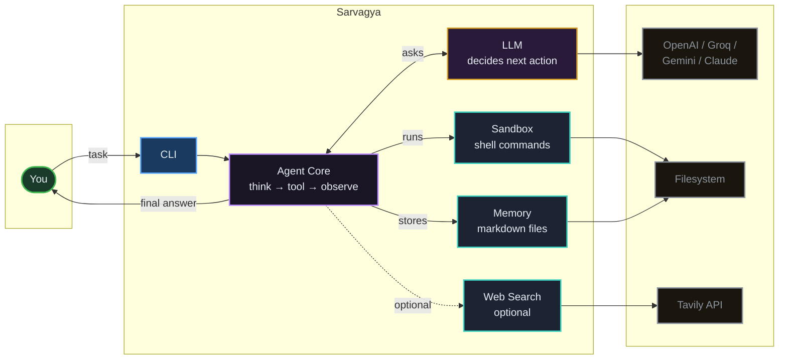
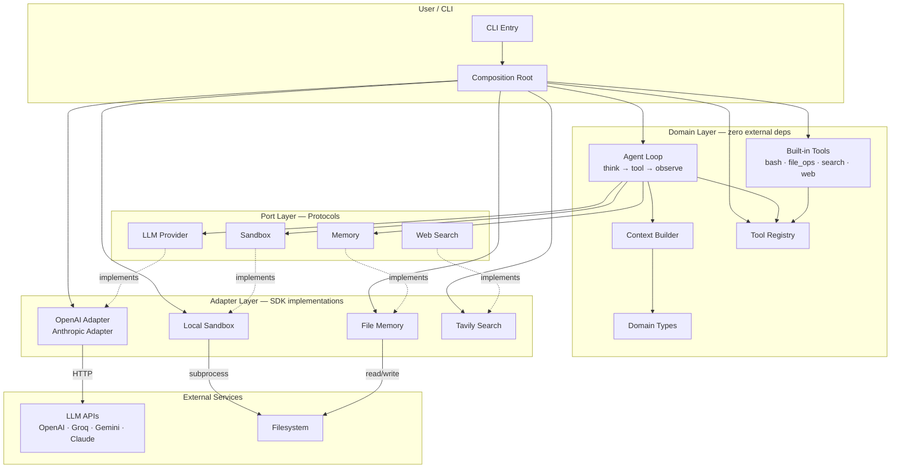
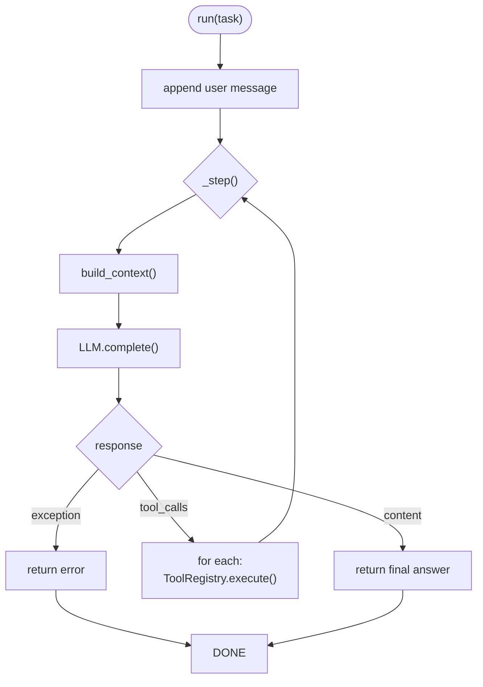
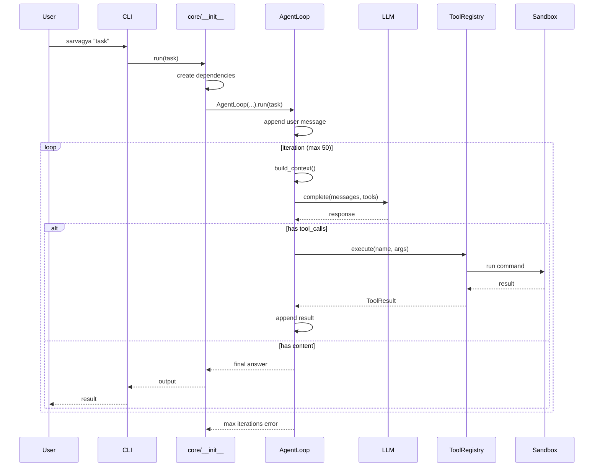

# Sarvagya

Autonomous AI agent. Takes a task, uses an LLM to decide actions, executes them, returns results. ~1000 lines.

```bash
pip install -e ".[all]"
set API_KEY=sk-...   set MODEL=gpt-4o
sarvagya "List all Python files in this project"
```

---

## Architecture



**What it is:** An autonomous AI agent. You give it a task, it asks an LLM what to do, runs the tool, observes the result, asks again, repeats until it has a final answer.

**How it works:** `You → CLI → Core ↔ LLM → runs Sandbox/Memory/Search → loops back → final answer`

**Components:** CLI (accepts task), Agent Core (orchestrates), LLM (decides), Sandbox (executes commands), Memory (stores notes), Web Search (optional)

**Externals:** LLM APIs (OpenAI, Groq, Gemini, Claude), Filesystem, Tavily (optional)

**Tech:** Python 3.13 · OpenAI SDK · Anthropic SDK · hexagonal pattern · markdown files

## Implementation Details

### Architecture Layers (Hexagonal / Ports & Adapters)



### Agent Loop



### File Structure

```
sarvagya/
├── main.py                    CLI entry + DI
├── prompts/
│   └── system.md              Agent identity & rules
├── core/                      Zero external dependencies
│   ├── __init__.py            Composition root
│   ├── types.py               8 dataclasses
│   ├── loop.py                AgentLoop
│   ├── context.py             Prompt assembly
│   ├── tool_registry.py       Register + dispatch
│   └── tools/
│       ├── bash.py            Shell execution
│       ├── file_ops.py        Read/write/edit
│       ├── search_ops.py      Glob/grep
│       └── web.py             Web fetch
├── ports/                     Protocols only
│   ├── llm.py                 LLMProvider
│   ├── sandbox.py             Sandbox
│   ├── memory.py              Memory
│   └── search.py              WebSearch
└── adapters/                  SDK implementations
    ├── llm/
    │   ├── openai.py          OpenAI/Groq/Gemini
    │   └── anthropic.py       Anthropic Claude
    ├── sandbox/
    │   └── local.py           Subprocess
    ├── memory/
    │   └── filesystem.py      Markdown files
    └── search/
        └── tavily.py          Tavily search
```

### Data Flow



### Domain Types


### Tools Reference

| Tool | Handler | Parameters | Required |
|------|---------|------------|----------|
| **bash** | `sandbox.execute()` | command, timeout, description | command, description |
| **read** | `_read()` | file_path, offset, limit | file_path |
| **write** | `_write()` | file_path, content | file_path, content |
| **edit** | `_edit()` | file_path, old_string, new_string, replace_all | file_path, old_string, new_string |
| **glob** | `handle_glob()` | pattern, path | pattern |
| **grep** | `handle_grep()` | pattern, path, include | pattern |
| **webfetch** | `handle_webfetch()` | url | url |
| **websearch** | `tavily.search()` | query | query |

`websearch` only available if `TAVILY_API_KEY` is set.

## Design Decisions

| Decision | Choice | Why |
|---|---|---|
| Architecture | Hexagonal (Ports & Adapters) | Zero coupling to any LLM provider |
| Core deps | **Zero external** | `core/` imports only stdlib |
| Provider detection | Model name heuristic | Swap by changing `--model` |
| Provider auth | Single `API_KEY` | One env var for any provider |
| Sandbox | Local subprocess | Replaceable with cloud sandbox |
| Memory | Filesystem markdown | No database needed |
| Agent loop | Sync, one tool per iteration | Simple, observable |
| Prompts | Markdown files | Editable without code changes |
| Functions | ≤30 lines | Enforced by AST check |

## Auth

```bash
set API_KEY=sk-...   set MODEL=gpt-4o
set OPENAI_BASE_URL=https://api.groq.com/openai/v1   # if needed

# or inline
sarvagya "task" --model gpt-4o --api-key sk-...
```

## Install

```bash
pip install -e ".[all]"         # all providers
pip install -e ".[openai]"      # OpenAI-compatible only
pip install -e ".[anthropic]"   # Anthropic only
```

## Stats

| Metric | Value |
|--------|-------|
| Python files | 17 |
| Total lines | ~1000 |
| External deps | 3 (all optional) |
| Adapters | 5 |
| Protocols | 4 |
| Tools | 8 |
