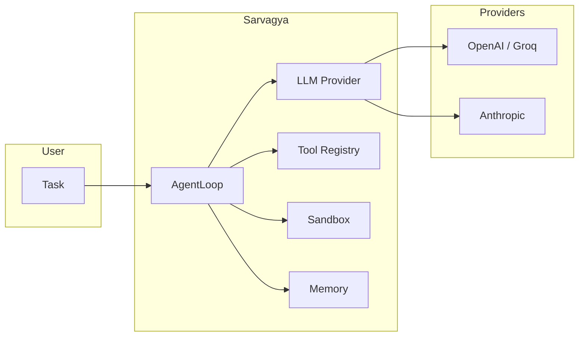

# Sarvagya

Autonomous AI agent. Framework-agnostic, provider-agnostic, minimal.

## Architecture



## Quick Start

```bash
# Install
pip install -e ".[all]"

# Set API key
set GROQ_API_KEY=gsk_your_key

# Run
sarvagya "List all Python files in this project"
```

## Provider Options

| Variable | Provider | SDK |
|----------|----------|-----|
| `GROQ_API_KEY` | Groq (via OpenAI SDK) | `openai` |
| `ANTHROPIC_API_KEY` | Anthropic Claude | `anthropic` |
| `TAVILY_API_KEY` | Tavily web search | `tavily-python` |

Use `--provider anthropic` to switch to Claude:

```bash
set ANTHROPIC_API_KEY=sk-ant-your_key
sarvagya "Explain this codebase" --provider anthropic
```

## Design

- **Hexagonal Architecture**: `core/` has zero external dependencies
- **Ports & Adapters**: Swap providers by changing config, not code
- **One action per iteration**: Simple, observable, debuggable
- **Minimal**: ~1100 lines total. No over-engineering.

## Project Structure

```
sarvagya/
  core/          Domain types, loop, tools, context (pure Python)
  ports/         Interfaces (Protocols)
  adapters/      Provider implementations (one file per provider)
  main.py        Composition root
```
